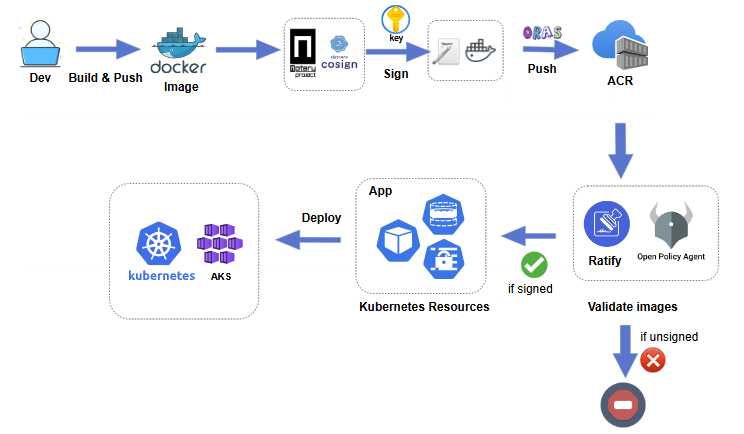

# Ratify on Azure: Allow only signed images to be deployed on AKS with Ratify

Signing container images ensure their authenticity and integrity. By deploying only signed images on Azure Kubernetes Service (AKS), you can ensure that the images come from a trusted origin and have not been altered since they were created.

With Azure Container Registry (ACR), you can store and distribute images with signatures together. You can use Azure Key Vault (AKV) to keep your signing keys and certificates safe, and then use tools like Notation or Cosign to sign your container images with them.

This article walks you through an end-to-end workflow of deploying only signed images on AKS with Ratify.



In this article:

* Prerequisites
  * Set up your Azure workload identity
  * Set up your ACR
  * Set up your AKS
  * Install Ratify and Gatekeeper on AKS
* Sign container images in ACR
  * Use Notation with certificates stored in AKV
  * Use Cosign with keys stored in AKV
* Configure Ratify and OPA Gatekeeper
  * Configure the store resource for accessing ACR
  * Configure key management provider resources for keys and certificates in AKV
  * Configure Notation verifier custom resource
  * Configure Cosign verifier custom resource 
* Deploy container images in AKS

> Please note that the examples and commands provided in this document are specifically designed for the Linux operating system.

## Prerequisite

### Configure environment variables

```shell
export TENANT_ID=<your Tenant ID>
export SUB_ID=<your subscription id>

export AKV_RG=<your AKV resource group>
export AKV_NAME=<your AKV name>
export KEY_NAME=<your key name>

export ACR_RG=<your ACR resource group>
export ACR_NAME=<your ACR name>

export AKS_RG=<your AKS resource group>
export AKS_NAME=<your AKS name>

export IDENTITY_NAME=<your identity name>
export IDENTITY_RG=<your identity resource group name>

export IMAGE_SIGNED="$ACR_NAME.azurecr.io/ratify-demo/net-monitor:v1"
export IMAGE_SIGNED_SOURCE=https://github.com/wabbit-networks/net-monitor.git#main

export IMAGE_UNSIGNED="$ACR_NAME.azurecr.io/ratify-demo/net-watcher:v1"
export IMAGE_UNSIGNED_SOURCE=https://github.com/wabbit-networks/net-watcher.git#main

export RATIFY_NAMESPACE="gatekeeper-system"
```

### Sign in with Azure CLI

```shell
az login
```

To learn more about Azure CLI and how to sign in with it, see [Sign in with Azure CLI](https://learn.microsoft.com/en-us/cli/azure/authenticate-azure-cli).

### Build and push images to ACR

> NOTE: You can skip this section if you already built and pushed images to ACR.

Login to ACR and ensure the logged-in users has the role `acrpush` and `acrpull` roles assigned.

```shell
az acr login --name $ACR_NAME
```

Build and push an image that will be signed in later steps.

```shell
az acr build -r $ACR_NAME -t $IMAGE_SIGNED $IMAGE_SIGNED_SOURCE --no-logs
```

Build and push an image that will not be signed.

```shell
az acr build -r $ACR_NAME -t $IMAGE_UNSIGNED $IMAGE_UNSIGNED_SOURCE --no-logs
```

### Set up your Azure workload identity

Ratify pulls artifacts from an ACR using Workload Federated Identity in an AKS cluster. For an overview on how workload identity operates in Azure, refer to the [documentation](https://docs.microsoft.com/en-us/azure/active-directory/develop/workload-identity-federation). You can use workload identity federation to configure an Azure AD app registration or user-assigned managed identity. The following workflow includes the Workload Identity configuration.

1. Create a Workload Federated Identity.

    ```shell
    az identity create --name "${IDENTITY_NAME}" --resource-group "${IDENTITY_RG}" --location "${LOCATION}" --subscription "${SUB_ID}"

    export IDENTITY_OBJECT_ID="$(az identity show --name "${IDENTITY_NAME}" --resource-group "${IDENTITY_RG}" --query 'principalId' -otsv)"
    export IDENTITY_CLIENT_ID=$(az identity show --name ${IDENTITY_NAME} --resource-group ${IDENTITY_RG} --query 'clientId' -o tsv)
    ```

1. Configure user-assigned managed identity and enable `AcrPull` role to the workload identity.

```shell
az role assignment create \
    --assignee-object-id ${IDENTITY_OBJECT_ID} \
    --role acrpull \
    --scope subscriptions/${SUB_ID}/resourceGroups/${ACR_RG}/providers/Microsoft.ContainerRegistry/registries/${ACR_NAME}
```

### Set up your AKS

1. Create an OIDC enabled AKS cluster. You can skip this step if you have an AKS cluster with OIDC enabled.

    ```shell
    # Install the aks-preview extension
    az extension add --name aks-preview

    # Register the 'EnableWorkloadIdentityPreview' feature flag
    az feature register --namespace "Microsoft.ContainerService" --name "EnableWorkloadIdentityPreview"
    az provider register --namespace Microsoft.ContainerService

    az aks create \
        --resource-group "${AKS_RG}" \
        --name "${AKS_NAME}" \
        --node-vm-size Standard_DS3_v2 \
        --node-count 1 \
        --generate-ssh-keys \
        --enable-workload-identity \
        --attach-acr ${ACR_NAME} \
        --enable-oidc-issuer

    # Connect to the AKS cluster:
    az aks get-credentials --resource-group ${AKS_RG} --name ${AKS_NAME}

    export AKS_OIDC_ISSUER="$(az aks show -n ${AKS_NAME} -g ${AKS_RG} --query "oidcIssuerProfile.issuerUrl" -otsv)"
    ```

    > Note: The official steps for setting up Workload Identity on AKS can be found [here](https://azure.github.io/azure-workload-identity/docs/quick-start.html).

    This step above may take around 10 minutes to complete. The registration status can be checked by running the following command:

    ```shell
    az feature show --namespace "Microsoft.ContainerService" --name "EnableWorkloadIdentityPreview" -o table
    Name                                                      RegistrationState
    --------------------------------------------------------    -------------------
    Microsoft.ContainerService/EnableWorkloadIdentityPreview    Registered
    ```

1. Update an existing AKS cluster with OIDC enabled. You can skip this step if you have an AKS cluster with OIDC enabled.

    ```shell
    az aks update -g ${AKS_RG} -n ${AKS_NAME} --enable-oidc-issuer --enable-workload-identity
    ```

1. Establish federated identity credential. On AZ CLI `${RATIFY_NAMESPACE}` is where you deploy Ratify:

    ```shell
    az identity federated-credential create \
    --name ratify-federated-credential \
    --identity-name "${IDENTITY_NAME}" \
    --resource-group "${IDENTITY_RG}" \
    --issuer "${AKS_OIDC_ISSUER}" \
    --subject system:serviceaccount:"${RATIFY_NAMESPACE}":"ratify-admin"
    ```

### Authorize access to AKV

#### Image signed with Notation and certificates in AKV

> [!IMPORTANT]
> Ratify requires secret permissions to retrieve the root CA certificate from the entire certificate chain,
 please set private keys to Non-exportable at certificate creation time to avoid security risk. Learn more about non-exportable keys [here](https://learn.microsoft.com/en-us/azure/key-vault/certificates/how-to-export-certificate?tabs=azure-cli#exportable-and-non-exportable-keys)
> 
> For security or other reasons (such as you are from a different organization), you may not be able to access AKV and get the root CA certificates. In that case, you can use the [inline certificate provider](../reference/custom%20resources/certificate-stores.md#inline-certificate-provider) to specify the root CA certificate value directly, without needing AKV.

Assign `Key Vault Secrets User` role to this identity for accessing AKV

```shell
az role assignment create --role "Key Vault Secrets User" --assignee ${IDENTITY_OBJECT_ID} \
--scope "/subscriptions/${SUB_ID}/resourceGroups/${AKV_RG}/providers/Microsoft.KeyVault/vaults/${AKV_NAME}"
```

#### Images signed with Cosign and keys in AKV

Assign `Key Vault Crypto User` role to this identity for accessing AKV

```shell
az role assignment create --role "Key Vault Crypto User" --assignee $IDENTITY_OBJECT_ID \
--scope "/subscriptions/${SUB_ID}/resourceGroups/${AKV_RG}/providers/Microsoft.KeyVault/vaults/${AKV_NAME}"
```

### Install Ratify and Gatekeeper on AKS

## Deploy Gatekeeper and Ratify on AKS

run `az aks show -g "${AKS_RG}" -n "${AKS_NAME}" --query addonProfiles.azurepolicy` to verify if the AKS cluster has azure policy addon enabled, learn more at [use azure policy](https://learn.microsoft.com/en-us/azure/aks/use-azure-policy)

### When Azure Policy Addon is not enabled

1. Deploy Gatekeeper from helm chart:

    ```shell
    helm repo add gatekeeper https://open-policy-agent.github.io/gatekeeper/charts

    helm install gatekeeper/gatekeeper  \
    --name-template=gatekeeper \
    --namespace gatekeeper-system --create-namespace \
    --set enableExternalData=true \
    --set validatingWebhookTimeoutSeconds=5 \
    --set mutatingWebhookTimeoutSeconds=2 \
    --set externaldataProviderResponseCacheTTL=10s
    ```

1. Install Ratify on AKS from helm chart:

    ```shell
    # Add a Helm repo
    helm repo add ratify https://deislabs.github.io/ratify

    # Install Ratify
    helm install ratify \
        ratify/ratify --atomic \
        --namespace ${RATIFY_NAMESPACE} --create-namespace \
        --set featureFlags.RATIFY_CERT_ROTATION=true \
        --set azureWorkloadIdentity.clientId=${IDENTITY_CLIENT_ID}
    ```

1. Enforce Gatekeeper policy to allow only signed images can be deployed on AKS:

    ```shell
    kubectl apply -f https://deislabs.github.io/ratify/library/default/template.yaml
    kubectl apply -f https://deislabs.github.io/ratify/library/default/samples/constraint.yaml
    ```

### When Azure Policy Addon is enabled on AKS

1. Ensure your AKS cluster is 1.26+
1. `az feature register -n AKS-AzurePolicyExternalData --namespace Microsoft.ContainerService`
1. Install Ratify on AKS from helm chart:

    ```shell
    # Add a Helm repo
    helm repo add ratify https://deislabs.github.io/ratify
    helm repo update

    # Install Ratify
    helm install ratify \
        ratify/ratify --atomic \
        --namespace gatekeeper-system --create-namespace \
        --set provider.enableMutation=false \
        --set featureFlags.RATIFY_CERT_ROTATION=true \
        --set azureWorkloadIdentity.clientId=${IDENTITY_CLIENT_ID}
    ```

1. Create and assign azure policy on your cluster:

    ```shell
    custom_policy=$(curl -L https://raw.githubusercontent.com/deislabs/ratify/main/library/default/customazurepolicy.json)
    definition_name="ratify-default-custom-policy"
    scope=$(az aks show -g "${AKS_RG}" -n "${AKS_NAME}" --query id -o tsv)

    definition_id=$(az policy definition create --name "${definition_name}" --rules "$(echo "${custom_policy}" | jq .policyRule)" --params "$(echo "${custom_policy}" | jq .parameters)" --mode "Microsoft.Kubernetes.Data" --query id -o tsv)

    assignment_id=$(az policy assignment create --policy "${definition_id}" --name "${definition_name}" --scope "${scope}" --query id -o tsv)

    echo "Please wait policy assignmet with id ${assignment_id} taking effect"
    echo "It often requires 15 min"
    echo "You can run 'kubectl get constraintTemplate ratifyverification' to verify the policy takes effect"
    ```

## Sign container images in ACR

### Use Notation with certificates stored in AKV

Depending on the type of certificates you use, you can refer to different documents to sign container images with Notation and AKV.

For self-signed certificates, see [Sign container images with Notation and Azure Key Vault using a self-signed certificate](https://learn.microsoft.com/en-us/azure/container-registry/container-registry-tutorial-sign-build-push).

For CA issued certificates, see [Sign container images with Notation and Azure Key Vault using a CA issued certificate](https://learn.microsoft.com/en-us/azure/container-registry/container-registry-tutorial-sign-trusted-ca).

```shell
export CERT_NAME=<your certificate name>
export SUBJECT_DN=<subject DN of the signing/leaf certificate>
# Optional
export KEY_ID=<your key identity for the signing/leaf certificate>
```

### Use Cosign with keys stored in AKV

1. Create a key in your AKV

    Ensure the logged-in identity assigned role `Key Vault Crypto Officer` for creating a key in AKV.

    ```shell
    az keyvault key create --vault-name $AKV_NAME -n $KEY_NAME --protection software
    ```

    Get the key id and retrieve the key version:

    ```shell
    az keyvault key show --name $KEY_NAME --vault-name $AKV_NAME --query "key.kid"
    ```

    An example output:

    ```text
    https://<your akv name>.vault.azure.net/keys/<your key name>/<version>
    ```

    Configure an environment variable for the version for later usage.

    ```shell
    export KEY_VER=<version>
    ```

1. Sign an image stored in your ACR

    Confirm no signatures before signing

    ```shell
    cosign tree $IMAGE_SIGNED
    ```
    
    Sign the image

    ```shell
    cosign sign --key azurekms://$AKV_NAME.vault.azure.net/$KEY_NAME/$KEY_VER --tlog-upload=false $IMAGE_SIGNED
    ```

    > In this article, use flag `--tlog-upload=false` to skip upload the signature to the transparent log (Rekor by default). 
    > Sign using key in AKV does not necessarily require the role `Key Vault Crypto Officer`, you can use another identity and assign the role `Key Vault Crypto User` for signing action only.

    Confirm the signature is pushed and associated with the image in ACR

    ```shell
    cosign tree $IMAGE_SIGNED
    ```

## Configure Ratify and OPA Gatekeeper

### Create a custom resource for accessing ACR

1. Create a configuration file for a `Store` custom resource named `store-oras`:

```shell
cat <<EOF > store_config.yaml
apiVersion: config.ratify.deislabs.io/v1beta1
kind: Store
metadata:
  name: store-oras
spec:
  name: oras
  parameters:
    authProvider:
      name: azureWorkloadIdentity
      clientID: $IDENTITY_CLIENT_ID
    cosignEnabled: true
EOF
```

1. Apply the configuration

    ```shell
    kubectl apply -f store_config.yaml
    ```

1. Confirm the configuration is applied successful.

    ```shell
    kubectl get Store store-oras
    ```

    Make sure the `ISSUCCESS` value is true in the results of above three commands. If it is not, you need to check the detailed error logs by using `kubectl describe` commands. For example,

    ```shell
    kubectl describe Store store-oras
    ```

### Create a custom resource for accessing AKV

1. Create a configuration file for a `keymanagementprovider` custom resource named `keymanagementprovider-akv`:

For verifying images signed with Notation using certificates in AKV, create the following configuration:

```shell
cat <<EOF > kmp_config.yaml
apiVersion: config.ratify.deislabs.io/v1beta1
kind: KeyManagementProvider
metadata:
  name: keymanagementprovider-akv
spec:
  type: azurekeyvault
  parameters:
    vaultURI: https://${AKV_NAME}.vault.azure.net/
    certificates:
      - name: ${CERT_NAME}
        version: ${KEY_ID} # Optional
    tenantID: ${TENANT_ID}
    clientID: ${IDENTITY_CLIENT_ID}
EOF
```

For verifying images signed with Cosign using keys in AKV, create the following configuration:

```shell
cat <<EOF > kmp_config.yaml
apiVersion: config.ratify.deislabs.io/v1beta1
kind: KeyManagementProvider
metadata:
  name: keymanagementprovider-akv
spec:
  type: azurekeyvault
  parameters:
    vaultURI: https://${AKV_NAME}.vault.azure.net/
    keys:
      - name: ${KEY_NAME}
        version: ${KEY_VER}
    tenantID: ${TENANT_ID}
    clientID: ${IDENTITY_CLIENT_ID}
EOF
```

> [!NOTE]
> You may combine the configuration into one `KeyManagementProvider` resource for both keys and certificates if they are stored in the same AKV.

1. Apply the configuration

    ```shell
    kubectl apply -f kmp_config.yaml
    ```

1. Confirm the configuration is applied successful.

    ```shell
    kubectl get KeyManagementProvider KeyManagementProvider-akv
    ```

    Make sure the `ISSUCCESS` value is true in the results of above three commands. If it is not, you need to check the detailed error logs by using `kubectl describe` commands. For example,

    ```shell
    kubectl describe KeyManagementProvider KeyManagementProvider-akv
    ```

### Configure the Notation verifier resource for verifying images signed with Notation

1. Create a configuration file for a `Verifier` custom resource named `verifier-notation`:

```shell
cat <<EOF > notation_config.yaml
apiVersion: config.ratify.deislabs.io/v1beta1
kind: Verifier
metadata:
  name: verifier-notation
spec:
  name: notation
  artifactTypes: application/vnd.cncf.notary.signature
  parameters:
    verificationCertStores:
      certs:
        - keymanagementprovider-akv
    trustPolicyDoc:
      version: "1.0"
      trustPolicies:
        - name: default
          registryScopes:
            - "*"
        signatureVerification:
            level: strict
        trustStores:
            - ca:certs
        trustedIdentities:
            - "x509.subject: ${SUBJECT_DN}"
EOF
```

1. Apply the configuration

    ```shell
    kubectl apply -f notation_config.yaml
    ```

1. Confirm the configuration is applied successful.

    ```shell
    kubectl get Verifier verifier-notation
    ```

    Make sure the `ISSUCCESS` value is true in the results of above three commands. If it is not, you need to check the detailed error logs by using `kubectl describe` commands. For example,

    ```shell
    kubectl describe Verifier verifier-notation
    ```

### Configuration for images signed with Cosign using keys in AKV

1. Create a configuration file for a `Verifier` custom resource named `verifier-cosign`:

```shell
cat <<EOF > cosign_config.yaml
apiVersion: config.ratify.deislabs.io/v1beta1
kind: Verifier
metadata:
  name: verifier-cosign
spec:
  name: cosign
  artifactTypes: application/vnd.dev.cosign.artifact.sig.v1+json
  parameters:
    trustPolicies:
      - name: default
        scopes:
          - "*"
        keys:
          - provider: keymanagementprovider-akv
EOF
```

1. Apply the verification configuration

    ```shell
    kubectl apply -f cosign_config.yaml
    ```

1. Confirm the configuration is applied successful.

    ```shell
    kubectl get Verifier verifier-cosign
    ```

    Make sure the `ISSUCCESS` value is true in the results of above three commands. If it is not, you need to check the detailed error logs by using `kubectl describe` commands. For example,

    ```shell
    kubectl describe Verifier verifier-cosign
    ```

## Deploy container images in AKS

Run the following command, since $IMAGE_SIGNED is signed with the key configured in Ratify, so this image was allowed for deployment after signature verification succeeded.

```bash
kubectl run demo-signed --image=$IMAGE_SIGNED
```

Run the following command, since $IMAGE_UNSIGNED is not signed, so this image was NOT allowed for deployment.

```bash
kubectl run demo-unsigned --image=$IMAGE_UNSIGNED
```

## Other scenarios

### Fine-tuned trust policy for Cosign verifier

You can configure different trust policies for images from various registry scope for the Cosign verifier. For example, you have two ACR: `$ACR_NAME1` and `$ACR_NAME2`. For `$ACR_NAME1`, you want to use `keymanagementprovider-akv1` resource, For `$ACR_NAME2`, you want to use `keymanagementprovider-akv2` resource. You can update Cosign Verifier resource as the following:

```yaml
apiVersion: config.ratify.deislabs.io/v1beta1
kind: Verifier
metadata:
  name: verifier-cosign
spec:
  name: cosign
  artifactTypes: application/vnd.dev.cosign.artifact.sig.v1+json
  parameters:
    trustPolicies:
      - name: $ACR_NAME1
        scopes:
          - "$ACR_NAME1.azurecr.io/*"
        keys:
          - provider: keymanagementprovider-akv1
      - name: $ACR_NAME2
        scopes:
          - "$ACR_NAME2.azurecr.io/*"
        keys:
          - provider: keymanagementprovider-akv2
```

For more information, please refer to the [scopes of Cosign verifier](../plugins/verifier/cosign.md#scopes) .

### Rotate the key used by Cosign

Keys in AKV may be rotated regularly as security best practice. If the key is rotated with a new version, you can update the `KeyManagementProvider` resource by adding the new version of the key, as currently Ratify (v1.2.0) does not support reconciling key resources regularly. For example, if the new version of key is set to environment variable `$KEY_VER_NEW`, you can do the following:

1. Add the new key `$KEY_VER_NEW` for `KeyManagementProvider` resource

    ```yaml
    apiVersion: config.ratify.deislabs.io/v1beta1
    kind: KeyManagementProvider
    metadata:
    name: keymanagementprovider-akv
    spec:
    type: azurekeyvault
    parameters:
        vaultURI: https://$AKV_NAME.vault.azure.net/
        keys:
        - name: $KEY_NAME
            version: $KEY_VER 
            version: $KEY_VER_NEW
        tenantID: $TENANT_ID
        clientID: $CLIENT_ID
    ```

1. Apply the new configuration

    ```shell
    kubectl apply -f verification_config.yaml
    ```

1. Confirm the new configuration is applied successfully

    ```shell
    kubectl get KeyManagementProvider keymanagementprovider-akv
    ```

### Disable the specific version of key used by Cosign

In some cases, you may need to disable a specific version of key. For example, the specific version of key is leaked. So, images signed using the specific version of key should not be trusted and the deployment of those images should be denied. As currently Ratify (v1.2.0) does not support reconciling key resources regularly, so you need to manually remove the version of key from `KeyManagementProvider` resource. For example, if version `$KEY_VER` is leaked, what you need to do is:

1. Disable the specific version from AKV, in this case, version `$KEY_VER` is disabled.

1. Rotate the key to a new version `$KEY_VER_NEW`, so that your images will be signed with new version.

1. Update `KeyManagementProvider` resource to add the new version of key and remove the disabled version

   The `KeyManagementProvider` resource will look like the following as disabled version `$KEY_VER` was removed.

    ```yaml
    apiVersion: config.ratify.deislabs.io/v1beta1
    kind: KeyManagementProvider
    metadata:
    name: keymanagementprovider-akv
    spec:
    type: azurekeyvault
    parameters:
        vaultURI: https://$AKV_NAME.vault.azure.net/
        keys:
        - name: $KEY_NAME
            version: $KEY_VER_NEW
        tenantID: $TENANT_ID
        clientID: $CLIENT_ID
    ```

    Apply the new configuration

    ```shell
    kubectl apply -f verification_config.yaml
    ```

    Confirm the new configuration is applied successfully

    ```shell
    kubectl get KeyManagementProvider keymanagementprovider-akv
    ```
